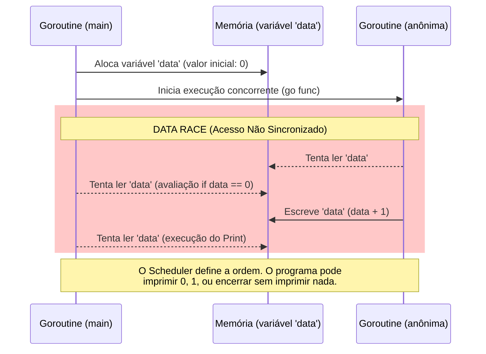

```go
package main

import (
    "fmt"
)

func main() {

    var data int

    go func() {
        data++
    }()

    if data == 0 {
        fmt.Println("The value is %d.", data)
    }
}

```

### 1. Visão Geral

O trecho de código acima ilustra uma **Data Race** (Condição de Corrida), uma falha crítica de segurança de memória em ambientes concorrentes. No ecossistema Go, uma Data Race ocorre quando duas ou mais *goroutines* acessam o mesmo endereço de memória simultaneamente, e pelo menos um desses acessos é uma operação de escrita.

No cenário apresentado, a *goroutine* principal (`main`) avalia a variável `data` e tenta imprimi-la, enquanto uma *goroutine* anônima modifica essa mesma variável (`data++`) em background, sem nenhum mecanismo de sincronização. Isso resulta em um comportamento não determinístico (o bloco `if` pode ou não ser executado dependendo de como o *scheduler* do Go gerencia as threads). Além da falha de concorrência, o código original utiliza `fmt.Println` incorretamente para interpolação de strings (o correto para formatar `%d` é `fmt.Printf`). A solução exige a aplicação de primitivas de sincronização para garantir que a memória seja acessada e modificada de forma segura e previsível.

### 2. Organização por Tópicos

O problema de acesso concorrente não seguro no Go pode ser resolvido principalmente através de duas abordagens arquiteturais:

* **Tópico 1: Sincronização de Memória Compartilhada (`sync.Mutex` e `sync.WaitGroup`):** Utilização de bloqueios tradicionais para garantir exclusividade mútua no acesso à variável de estado e barreiras para garantir a ordem de execução.
* **Tópico 2: Comunicação Segura via Canais (`channels`):** Aplicação do paradigma fundamental do Go: *"Não se comunique compartilhando memória; compartilhe memória se comunicando"*.

### 3. Visualização do Fluxo (Mermaid)



**Desconstrução do Fluxo Visual:**

* **Por que o erro ocorre:** O bloco vermelho (Data Race) destaca a ausência de um mecanismo de barreira. A goroutine `Main` avança para a avaliação condicional sem aguardar a conclusão do `Worker`.
* **Mecânica do impacto:** Como não há garantias de *happens-before* (ocorre antes), a leitura em `main` e a escrita na função anônima competem livremente. O detector de corrida do Go (`go run -race`) identificaria e abortaria a execução deste código em ambiente de desenvolvimento/teste.

---

### 4. Exemplos de Código (Idiomático)

#### Tópico 1: Sincronização de Memória Compartilhada

```go
package main

import (
	"fmt"
	"sync"
)

func main() {
	var data int
	var wg sync.WaitGroup
	var mu sync.Mutex

	// Registra que há 1 goroutine para aguardar
	wg.Add(1)

	go func() {
		// Garante que o contador do WaitGroup seja decrementado ao final
		defer wg.Done()

		// Trava a memória para acesso exclusivo
		mu.Lock()
		data++
		mu.Unlock()
	}()

	// Bloqueia a goroutine main até que wg chegue a 0
	wg.Wait()

	// Trava novamente para leitura segura
	mu.Lock()
	if data == 1 {
		// Corrigido para fmt.Printf
		fmt.Printf("The value is %d.\n", data)
	}
	mu.Unlock()
}

```

### 5. Implementação Passo a Passo (Tópico 1)

* **`sync.WaitGroup` (`wg.Add(1)`, `wg.Done()`, `wg.Wait()`):** Resolve o problema de ordem de execução. Ao adicionar `1`, dizemos à thread principal que existe um processo pendente. O `wg.Wait()` cria uma barreira, impedindo que a `main` avalie a variável `data` antes da goroutine secundária sinalizar sua conclusão via `defer wg.Done()`.
* **`sync.Mutex` (`mu.Lock()`, `mu.Unlock()`):** Resolve a condição de corrida isolando o acesso à variável `data`. Garante exclusão mútua (apenas uma goroutine acessa a variável por vez). Embora o `WaitGroup` force a ordem neste script específico, usar o `Mutex` é a prática correta para blindar modificações de estado compartilhado.
* **`fmt.Printf`:** Substitui o `Println` equivocado do código original para permitir a interpolação do verbo de formatação `%d`.

---

#### Tópico 2: Comunicação Segura via Canais (Abordagem Idiomática)

```go
package main

import (
	"fmt"
)

func main() {
	// Cria um canal sem buffer (unbuffered channel) do tipo int
	ch := make(chan int)

	go func() {
		// O estado é gerenciado localmente na goroutine
		var internalData int
		internalData++
		
		// Envia o resultado processado através do canal
		ch <- internalData
	}()

	// Bloqueia a goroutine main até receber um valor do canal
	data := <-ch

	if data == 1 {
		fmt.Printf("The value is %d.\n", data)
	}
}

```

### 5. Implementação Passo a Passo (Tópico 2)

* **`ch := make(chan int)`:** Instancia um canal de inteiros. Em Go, canais não cacheados (*unbuffered channels*) agem naturalmente como barreiras de sincronização. A emissão de um valor e sua respectiva recepção devem ocorrer simultaneamente.
* **Isolamento de Estado (`internalData`):** A variável global compartilhada é eliminada. A goroutine secundária agora encapsula sua própria lógica de mutação em uma variável local. Isso erradica o risco de Data Race por design.
* **Sincronização Implícita (`data := <-ch`):** A tentativa de extrair um valor do canal força a thread `main` a pausar (bloquear) até que a goroutine anônima envie o dado (`ch <- internalData`). O canal orquestra a passagem segura dos dados e garante a ordem lógica de execução dispensando o uso do pacote `sync`.