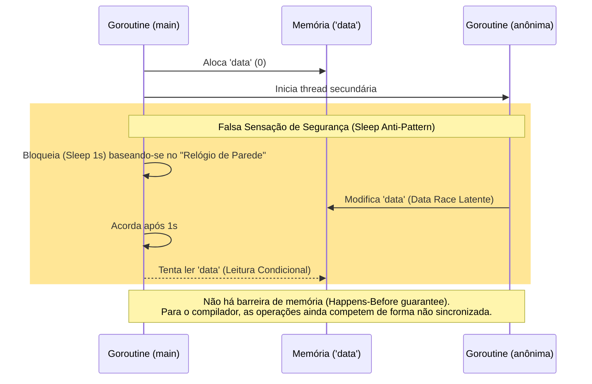

```go
package main

import (
    "fmt"
    "time"
)

func main() {

    var data int

    go func() {
        data++
    }()
    time.Sleep(1 * time.Second)
    if data == 0 {
        fmt.Println("The value is %d.", data)
    }
}

```

### 1. Visão Geral

O trecho de código acima introduz um conhecido anti-padrão de concorrência chamado **"Sleep Synchronization"** (Sincronização baseada em tempo). O desenvolvedor tentou corrigir a condição de corrida forçando a *goroutine* principal a pausar (`time.Sleep`) na esperança de dar tempo suficiente para a *goroutine* anônima executar o incremento de `data`.

Embora na prática (durante a execução em uma máquina comum) esse código quase sempre evite a colisão, **arquiteturalmente a Data Race continua existindo**. O compilador do Go e o detector de corrida (`go run -race`) não reconhecem `time.Sleep` como uma barreira de memória ou um evento *Happens-Before* (garantia de que a operação A ocorre antes da operação B). Sob carga extrema, pausas do Garbage Collector, ou restrições de CPU, o incremento pode demorar mais de 1 segundo, reintroduzindo a falha. Adicionalmente, o erro de formatação na função `fmt.Println` persiste (o correto é `fmt.Printf`).

### 2. Organização por Tópicos

Para resolver de forma determinística — removendo o "achismo" temporal —, devemos substituir o bloqueio arbitrário (`time.Sleep`) por bloqueios estruturais que aguardam eventos reais, independentemente de quanto tempo levem:

* **Tópico 1: Sincronização Estrutural (`sync.WaitGroup`):** Substituir o tempo arbitrário de espera por um semáforo que sinaliza exatamente quando a tarefa de background terminou.
* **Tópico 2: Orquestração Baseada em Eventos (Canais):** Eliminar o acesso à memória compartilhada e tratar o resultado da goroutine como um evento emitido em um canal.

### 3. Visualização do Fluxo (Mermaid)



**Desconstrução do Fluxo Visual:**

* O diagrama evidencia a fragilidade do uso de relógio (*wall-clock*) para controle de concorrência.
* A `Main` acorda às cegas após 1 segundo e lê a memória, assumindo que a `Worker` já finalizou, sem nenhuma prova algorítmica de que isso realmente aconteceu.

---

### 4. Exemplos de Código (Idiomático)

#### Tópico 1: Sincronização Estrutural (`sync.WaitGroup`)

```go
package main

import (
	"fmt"
	"sync"
)

func main() {
	var data int
	var wg sync.WaitGroup
	var mu sync.Mutex

	wg.Add(1)

	go func() {
		defer wg.Done()
		
		mu.Lock()
		data++
		mu.Unlock()
	}()

	// Substituímos o time.Sleep genérico por uma espera determinística
	wg.Wait()

	mu.Lock()
	if data == 1 {
		fmt.Printf("The value is %d.\n", data)
	}
	mu.Unlock()
}

```

### 5. Implementação Passo a Passo (Tópico 1)

* **Remoção do `time.Sleep`:** A espera agora é orientada a eventos (`wg.Wait()`), não a cronômetros. A thread `main` não espera 1 segundo cravado; ela espera *exatamente o tempo necessário* (provavelmente microssegundos) para que a goroutine termine. Isso otimiza imensamente a performance e o uso da CPU.
* **`wg.Done()`:** Ao ser invocado, age como a sinalização verde que libera a barreira criada no `wg.Wait()`. Estabelece firmemente a relação de *happens-before* requerida pela segurança de memória do Go.
* **Adoção do Mutex:** Apesar da ordem garantida pelo WaitGroup, aplicamos o `Mutex` ao redor de `data` para blindar rigorosamente a memória compartilhada contra concorrência arbitrária.

---

#### Tópico 2: Orquestração Baseada em Eventos (Canais)

```go
package main

import (
	"fmt"
)

func main() {
	// Substitui a variável global por um canal de tráfego de dados
	done := make(chan int)

	go func() {
		var internalData int
		internalData++
		
		// Sinaliza conclusão e trafega o dado simultaneamente
		done <- internalData
	}()

	// A própria extração do canal bloqueia a main (substituindo o Sleep)
	data := <-done

	if data == 1 {
		fmt.Printf("The value is %d.\n", data)
	}
}

```

### 5. Implementação Passo a Passo (Tópico 2)

* **Aposentadoria do pacote `time`:** A comunicação com canais (*channels*) bloqueia intrinsecamente a goroutine que tenta receber (`<-done`) até que haja um dado a ser recebido. O canal age simultaneamente como o veículo do dado e a trava de sincronização.
* **Escopo Limitado e Seguro:** Não havendo a variável `data` exposta a todo o pacote `main`, a anomalia da Data Race é completamente evitada. A thread secundária opera em seu próprio escopo sem efeitos colaterais visíveis externamente até o momento do envio via canal.