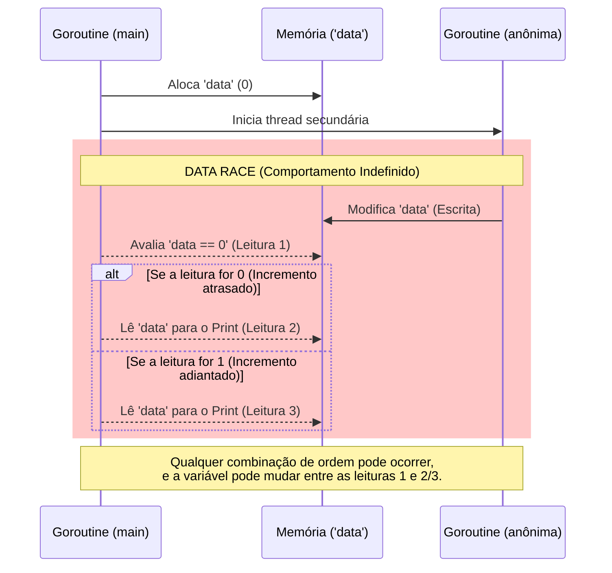

```go
package main

import (
    "fmt"
)

func main() {

    var data int

    go func() {
        data++
    }()

    if data == 0 {
        fmt.Println("The value is %d.", data)
    } else {
        fmt.Println("The value is %d.", data)
    }
}

```

### 1. Visão Geral

O trecho de código atualizado continua apresentando uma **Data Race** (Condição de Corrida) severa. A adição da cláusula `else` garante que um bloco de impressão será executado independentemente do valor lido em `data`, mas não resolve o problema arquitetural: a concorrência desprotegida. A *goroutine* principal (`main`) realiza leituras sucessivas de `data` (na avaliação condicional e dentro dos blocos de impressão) enquanto a *goroutine* anônima realiza uma operação de mutação (`data++`).

Como não há garantias de sincronização, o escalonador do Go pode executar o incremento antes, durante ou depois da avaliação do `if`. Ler e escrever no mesmo endereço de memória concorrentemente resulta em comportamento imprevisível. Além disso, o erro de sintaxe padrão permanece: `fmt.Println` não interpreta verbos de formatação (`%d`); a função correta para este propósito é `fmt.Printf`.

### 2. Organização por Tópicos

A resolução deste antipadrão concorrente pode ser feita mantendo o comportamento de bifurcação (`if/else`), porém aplicando primitivas seguras de concorrência:

* **Tópico 1: Mutexes e WaitGroups (`sync` package):** O uso de travas mecânicas na memória para forçar o sequenciamento determinístico das operações de leitura e escrita.
* **Tópico 2: Passagem de Mensagens (Canais):** O uso da abordagem idiomática do Go, eliminando o compartilhamento de memória global e trafegando a mutação de estado como um evento através de um canal.

### 3. Visualização do Fluxo (Mermaid)



---

### 4. Exemplos de Código (Idiomático)

#### Tópico 1: Sincronização de Memória Compartilhada

```go
package main

import (
	"fmt"
	"sync"
)

func main() {
	var data int
	var wg sync.WaitGroup
	var mu sync.Mutex

	wg.Add(1)

	go func() {
		defer wg.Done()
		
		mu.Lock()
		data++
		mu.Unlock()
	}()

	// Aguarda o processamento concorrente terminar
	wg.Wait()

	mu.Lock()
	// Com o WaitGroup garantindo a ordem, data sempre será 1 aqui.
	// O if/else é mantido para preservar a estrutura lógica solicitada.
	if data == 0 {
		fmt.Printf("The value is %d.\n", data)
	} else {
		fmt.Printf("The value is %d.\n", data)
	}
	mu.Unlock()
}

```

### 5. Implementação Passo a Passo (Tópico 1)

* **`sync.WaitGroup`:** O método `wg.Wait()` assegura que a execução de `main` seja suspensa até que a *goroutine* anônima conclua o incremento de `data` e acione `wg.Done()`.
* **Determinismo:** Ao introduzir a barreira de espera, o bloco `else` se torna a rota de execução garantida e previsível, pois sabemos que a *goroutine* alterou a variável de estado antes da avaliação do `if`.
* **`sync.Mutex`:** A engrenagem de `mu.Lock()`/`mu.Unlock()` empacota o acesso à variável garantindo exclusão mútua, uma defesa robusta necessária se o escopo da aplicação escalar.
* **`fmt.Printf`:** A formatação foi corrigida.

---

#### Tópico 2: Comunicação Segura via Canais (Abordagem Idiomática)

```go
package main

import (
	"fmt"
)

func main() {
	ch := make(chan int)

	go func() {
		var internalData int
		internalData++
		
		ch <- internalData
	}()

	// A extração do dado do canal atua como uma barreira de sincronização nativa
	data := <-ch

	if data == 0 {
		fmt.Printf("The value is %d.\n", data)
	} else {
		fmt.Printf("The value is %d.\n", data)
	}
}

```

### 5. Implementação Passo a Passo (Tópico 2)

* **Remoção da Data Race por Design:** Ao invés de lutar pela escrita e leitura de uma variável ponteiro do mesmo escopo, a goroutine detém o domínio total do estado via `internalData`.
* **`ch <- internalData` e `<-ch`:** O canal *unbuffered* faz o *handshake* automático entre a emissão da goroutine secundária e a recepção da `main`. A thread principal fica paralisada na linha `data := <-ch` até que o valor chegue.
* **Manutenção Condicional:** Embora logicamente o valor extraído seja previsível (sempre cairá no `else`), este design escala de forma muito mais elegante se a função concorrente fosse encarregada de injetar valores dinâmicos ou aleatórios no canal.