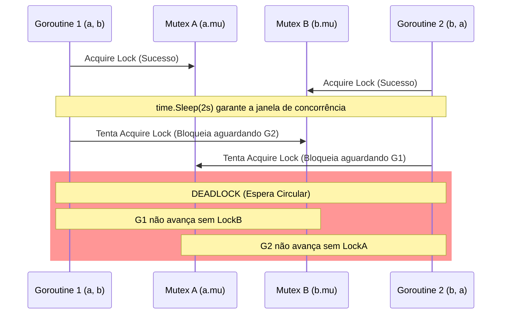

```go
package main

import (
    "fmt"
    "sync"
    "time"
)

func main() {

    type value struct {
        mu    sync.Mutex
        value int
    }

    var wg sync.WaitGroup
    printSum := func(v1, v2 *value) {
        defer wg.Done()
        v1.mu.Lock()
        defer v1.mu.Unlock()

        time.Sleep(2 * time.Second)
        v2.mu.Lock()
        defer v2.mu.Unlock()

        fmt.Println("sum=%d", v1.value+v2.value)

    }

    var a, b value
    wg.Add(2)
    go printSum(&a, &b)
    go printSum(&b, &a)
    wg.Wait()
}

```

### 1. Visão Geral

O trecho de código demonstra um **Deadlock** clássico (impasse ou abraço mortal). Um deadlock ocorre quando duas ou mais *goroutines* ficam bloqueadas indefinidamente, cada uma aguardando um recurso (neste caso, um `sync.Mutex`) que está sendo retido pela outra.

No cenário acima, temos uma dependência circular explícita:

* A primeira *goroutine* recebe `(&a, &b)`. Ela trava `a.mu`, dorme por 2 segundos e tenta travar `b.mu`.
* A segunda *goroutine* recebe `(&b, &a)`. Ela trava `b.mu`, dorme por 2 segundos e tenta travar `a.mu`.

O `time.Sleep` garante que ambas as *goroutines* adquiram seu primeiro *lock* com sucesso antes de tentarem adquirir o segundo. O resultado é que a Goroutine 1 nunca liberará `a` até conseguir `b`, e a Goroutine 2 nunca liberará `b` até conseguir `a`. O *runtime* do Go detectará essa contenção onde todas as *threads* estão dormindo e abortará o programa com um erro fatal (`fatal error: all goroutines are asleep - deadlock!`). Além disso, há um erro de sintaxe padrão: `fmt.Println` não processa verbos de formatação como `%d` (o correto é `fmt.Printf`).

### 2. Organização por Tópicos

Para resolver esse problema de design de concorrência, podemos aplicar duas estratégias distintas, dependendo da necessidade de atomicidade estrita da aplicação:

* **Tópico 1: Redução da Granularidade (Desacoplamento de Locks):** A abordagem mais performática e simples. Evita reter múltiplos *locks* simultaneamente, extraindo os valores de forma independente antes de realizar a operação.
* **Tópico 2: Ordenação Hierárquica de Locks (Lock Ordering):** Quando reter múltiplos *locks* ao mesmo tempo é uma exigência inegociável da lógica de negócios, devemos estabelecer uma ordem global e consistente para a aquisição desses *locks*, quebrando a dependência circular.

### 3. Visualização do Fluxo (Mermaid)



**Desconstrução do Fluxo Visual:**

* O diagrama evidencia o exato instante em que o sistema entra em colapso. O uso de dois *locks* cruzados sem uma política de ordenação cria um bloqueio mutável. Nenhuma das setas de tentativa de aquisição subsequente (linhas bloqueadas) retorna, resultando no congelamento permanente de ambas as execuções.

---

### 4. Exemplos de Código (Idiomático)

#### Tópico 1: Redução da Granularidade (Desacoplamento de Locks)

```go
package main

import (
	"fmt"
	"sync"
	"time"
)

type value struct {
	mu    sync.Mutex
	value int
}

func main() {
	var wg sync.WaitGroup
	var a, b value

	printSum := func(v1, v2 *value) {
		defer wg.Done()

		// Trava, lê e destrava v1 independentemente
		v1.mu.Lock()
		val1 := v1.value
		v1.mu.Unlock()

		time.Sleep(2 * time.Second) // Simulação de latência

		// Trava, lê e destrava v2 independentemente
		v2.mu.Lock()
		val2 := v2.value
		v2.mu.Unlock()

		// A operação matemática e de I/O é feita fora da zona de lock
		fmt.Printf("sum=%d\n", val1+val2)
	}

	wg.Add(2)
	go printSum(&a, &b)
	go printSum(&b, &a)
	wg.Wait()
}

```

### 5. Implementação Passo a Passo (Tópico 1)

* **Prevenção por Escopo Limitado:** Modificamos a função `printSum` para nunca segurar o *lock* de `v1` enquanto tenta adquirir `v2`. Os *locks* são aplicados exclusivamente ao ato da leitura em memória (`val1 := v1.value`).
* **Remoção do `defer Unlock` Cego:** O uso de `defer` no código original estendia o tempo de vida do *lock* para toda a função, incluindo o `time.Sleep` e a chamada de I/O. Ao liberar o *lock* explicitamente e imediatamente após a leitura local, otimizamos o tempo de concorrência e eliminamos totalmente a chance de Deadlock.
* **Correção de I/O:** `fmt.Println` foi corrigido para `fmt.Printf`.

---

#### Tópico 2: Ordenação Hierárquica de Locks (Lock Ordering)

```go
package main

import (
	"fmt"
	"sync"
	"time"
)

// Inserimos um identificador único imutável para criar hierarquia
type value struct {
	id    int
	mu    sync.Mutex
	value int
}

func main() {
	var wg sync.WaitGroup
	a := value{id: 1}
	b := value{id: 2}

	printSum := func(v1, v2 *value) {
		defer wg.Done()

		// Garante que o lock sempre ocorra do menor ID para o maior ID,
		// independentemente da ordem dos parâmetros passados.
		first, second := v1, v2
		if v1.id > v2.id {
			first, second = v2, v1
		}

		first.mu.Lock()
		defer first.mu.Unlock()

		time.Sleep(2 * time.Second) // Simulação de latência

		second.mu.Lock()
		defer second.mu.Unlock()

		fmt.Printf("sum=%d\n", v1.value+v2.value)
	}

	wg.Add(2)
	go printSum(&a, &b)
	go printSum(&b, &a)
	wg.Wait()
}

```

### 5. Implementação Passo a Passo (Tópico 2)

* **Criação de Hierarquia (`id int`):** Quando você é estritamente obrigado a segurar dois *locks* simultaneamente (para garantir, por exemplo, que `v1` e `v2` não mudem de valor no intervalo de tempo entre a leitura de um e a leitura de outro), a regra de ouro é **sempre travar os recursos na mesma ordem em todo o sistema**. Adicionamos um `id` único para arbitrar essa ordem.
* **Arbitragem Dinâmica (`if v1.id > v2.id`):** O código avalia os IDs. Se a Goroutine 1 receber `(&a, &b)`, ela travará `a` (ID 1) depois `b` (ID 2). Se a Goroutine 2 receber `(&b, &a)`, a lógica interna forçará a inversão: ela também travará `a` (ID 1) primeiro, depois `b` (ID 2).
* **Quebra da Espera Circular:** Como ambas as *goroutines* agora concordam globalmente em tentar pegar a trava do ID menor primeiro (neste caso, a variável `a`), a Goroutine 2 não consegue adquirir `a` se a Goroutine 1 já o detém. A Goroutine 2 fica bloqueada esperando `a` e sequer tenta adquirir `b`. A Goroutine 1 prossegue livremente, pega `b`, calcula, libera as travas, e então a Goroutine 2 é destravada, finalizando a execução de forma previsível e segura.