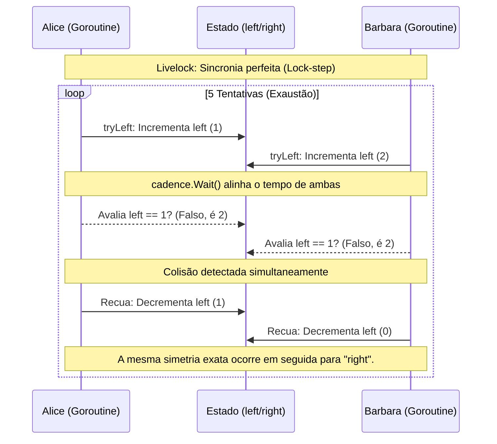

```go
package main

import (
    "bytes"
    "fmt"
    "sync"
    "sync/atomic"
    "time"
)

func main() {
    cadence := sync.NewCond(&sync.Mutex{})
    go func() {
        for range time.Tick(1 * time.Millisecond) {
            cadence.Broadcast()
        }
    }()

    takeStep := func() {
        cadence.L.Lock()
        cadence.Wait()
        cadence.L.Unlock()
    }

    tryDir := func(dirName string, dir *int32, out *bytes.Buffer) bool { // <1>
        fmt.Fprintf(out, " %v", dirName)
        atomic.AddInt32(dir, 1) // <2>
        takeStep()              // <3>
        if atomic.LoadInt32(dir) == 1 {
            fmt.Fprint(out, ". Success!")
            return true
        }
        takeStep()
        atomic.AddInt32(dir, -1) // <4>
        return false
    }

    var left, right int32
    tryLeft := func(out *bytes.Buffer) bool { return tryDir("left", &left, out) }
    tryRight := func(out *bytes.Buffer) bool { return tryDir("right", &right, out) }
    walk := func(walking *sync.WaitGroup, name string) {
        var out bytes.Buffer
        defer func() { fmt.Println(out.String()) }()
        defer walking.Done()
        fmt.Fprintf(&out, "%v is trying to scoot:", name)
        for i := 0; i < 5; i++ { // <1>
            if tryLeft(&out) || tryRight(&out) { // <2>
                return
            }
        }
        fmt.Fprintf(&out, "\n%v tosses her hands up in exasperation!", name)
    }

    var peopleInHallway sync.WaitGroup // <3>
    peopleInHallway.Add(2)
    go walk(&peopleInHallway, "Alice")
    go walk(&peopleInHallway, "Barbara")
    peopleInHallway.Wait()
}

```

### 1. Visão Geral

O trecho de código fornecido (um exemplo clássico frequentemente creditado à literatura avançada de concorrência em Go) demonstra perfeitamente a mecânica de um **Livelock** (Bloqueio Ativo).

Ao contrário de um Deadlock, onde as *goroutines* dormem permanentemente aguardando a liberação de um recurso, no Livelock as *goroutines* estão ativas, consumindo CPU e alterando seus estados. O problema raiz aqui é a **simetria estrita** e a **sincronização em lock-step**. A variável `cadence` força Alice e Barbara a agirem ao mesmo exato milissegundo. Elas tomam a mesma decisão (ir para a esquerda), percebem a colisão simultaneamente (`atomic.LoadInt32(dir) == 2`), recuam juntas e tentam a direita juntas, repetindo o ciclo até esgotarem suas 5 tentativas. O ecossistema Go compila e executa isso sem gerar pânico, pois não há contenção travada, mas a lógica de negócios não faz nenhum progresso.

### 2. Organização por Tópicos

Para mitigar Livelocks em sistemas reais concorrentes ou distribuídos, aplicamos duas filosofias principais para quebrar a simetria destrutiva:

* **Tópico 1: Quebra de Simetria via Jitter (Random Backoff):** Introduzir atrasos aleatórios permite que as execuções saiam do "lock-step". Uma *goroutine* avançará enquanto a outra temporariamente recua.
* **Tópico 2: Arbitragem Centralizada (Controle de Acesso):** Abordagem mais arquitetural que elimina a heurística de tentativa e erro, utilizando um bloqueio central (`sync.Mutex` ou canal) que garante que apenas um ator acesse o recurso crítico por vez.

### 3. Visualização do Fluxo (Mermaid)



**Implementação Passo a Passo (Diagrama):**

* A peça fundamental deste desastre orquestrado é o `takeStep()`. Ele impede que o *Scheduler* natural do Go intercale as instruções de forma assimétrica.
* Como Alice e Barbara leem o estado modificado após ambas terem escrito nele, elas sempre encontrarão um estado contaminado (conflito). Elas reagem de maneira perfeitamente igual ao conflito, garantindo que o próximo passo também resulte em colisão.

---

### 4. Exemplos de Código (Idiomático)

#### Tópico 1: Quebra de Simetria via Jitter (Random Backoff)

```go
package main

import (
	"bytes"
	"fmt"
	"math/rand"
	"sync"
	"sync/atomic"
	"time"
)

func main() {
	cadence := sync.NewCond(&sync.Mutex{})
	go func() {
		for range time.Tick(1 * time.Millisecond) {
			cadence.Broadcast()
		}
	}()

	takeStep := func() {
		cadence.L.Lock()
		cadence.Wait()
		cadence.L.Unlock()
	}

	tryDir := func(dirName string, dir *int32, out *bytes.Buffer) bool {
		fmt.Fprintf(out, " %v", dirName)
		atomic.AddInt32(dir, 1)
		takeStep()
		if atomic.LoadInt32(dir) == 1 {
			fmt.Fprint(out, ". Success!")
			return true
		}
		takeStep()
		atomic.AddInt32(dir, -1)
		return false
	}

	var left, right int32
	tryLeft := func(out *bytes.Buffer) bool { return tryDir("left", &left, out) }
	tryRight := func(out *bytes.Buffer) bool { return tryDir("right", &right, out) }

	walk := func(walking *sync.WaitGroup, name string) {
		var out bytes.Buffer
		defer func() { fmt.Println(out.String()) }()
		defer walking.Done()
		fmt.Fprintf(&out, "%v is trying to scoot:", name)

		for i := 0; i < 5; i++ {
			if tryLeft(&out) || tryRight(&out) {
				return
			}
			// Introduzindo Jitter (Backoff Aleatório) para quebrar o Lock-step
			time.Sleep(time.Duration(rand.Intn(10)) * time.Millisecond)
		}
		fmt.Fprintf(&out, "\n%v tosses her hands up in exasperation!", name)
	}

	var peopleInHallway sync.WaitGroup
	peopleInHallway.Add(2)
	go walk(&peopleInHallway, "Alice")
	go walk(&peopleInHallway, "Barbara")
	peopleInHallway.Wait()
}

```

**Implementação Passo a Passo:**

* **`rand.Intn(10)`:** Ao forçar a *goroutine* a dormir por um valor aleatório entre 0 e 9 milissegundos após uma tentativa fracassada, nós deliberadamente a dessincronizamos do `cadence`.
* **Quebra de Simetria:** Na próxima iteração, Alice pode tentar dar o passo enquanto Barbara ainda está dormindo (aplicando o backoff). Alice conseguirá avaliar `atomic.LoadInt32(dir) == 1` como verdadeiro e progredirá, resolvendo o Livelock através da aleatoriedade (padrão altissimamente recomendado para comunicação de rede e microserviços, como no roteamento de pacotes Ethernet).

---

#### Tópico 2: Arbitragem Centralizada (Controle de Acesso)

```go
package main

import (
	"fmt"
	"sync"
	"time"
)

func main() {
	// O corredor agora é modelado como um recurso que só aceita um acesso por vez.
	var hallway sync.Mutex
	var peopleInHallway sync.WaitGroup

	walk := func(walking *sync.WaitGroup, name string) {
		defer walking.Done()
		fmt.Printf("%v is trying to scoot.\n", name)

		// Trava o recurso central
		hallway.Lock()
		defer hallway.Unlock()

		// A lógica complexa de left/right e atomics desaparece.
		fmt.Printf("%v passed successfully!\n", name)
		time.Sleep(10 * time.Millisecond) // Simula o tempo de travessia
	}

	peopleInHallway.Add(2)
	go walk(&peopleInHallway, "Alice")
	go walk(&peopleInHallway, "Barbara")
	peopleInHallway.Wait()
}

```

**Implementação Passo a Passo:**

* **Remoção da Complexidade (`sync.Cond` e Atômicos):** Em engenharia de software pragmática, o Livelock muitas vezes indica um problema de modelagem. Substituímos a heurística "polida" das *goroutines* tentando desviar uma da outra por uma política estrita.
* **`hallway.Lock()`:** O acesso ao corredor é arbitrado por exclusão mútua. Se Alice adquirir o *lock*, Barbara entrará em estado de suspensão (sem consumir CPU) até que Alice termine e libere o recurso com `Unlock()`. Isso garante 100% de progresso ordenado (determinismo) e extingue instantaneamente o risco de Deadlock e Livelock.