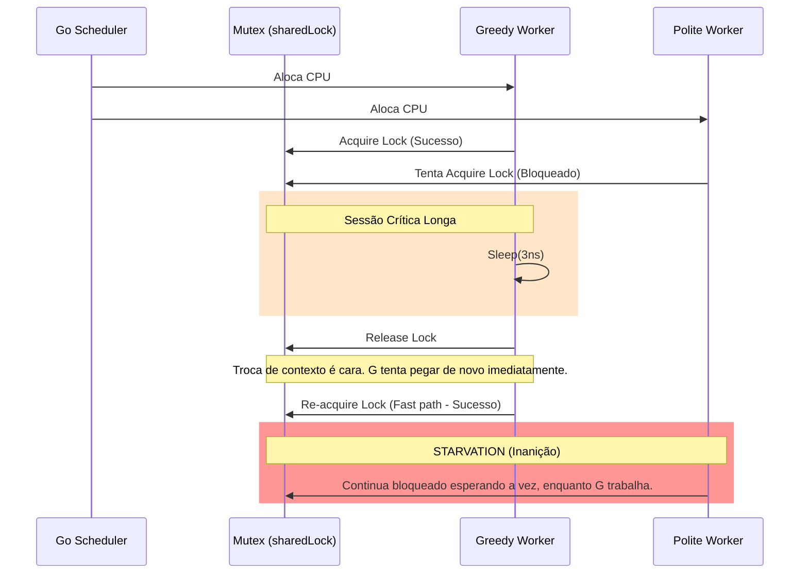

```go
package main

import (
    "fmt"
    "sync"
    "time"
)

func main() {
    var wg sync.WaitGroup
    var sharedLock sync.Mutex
    const runtime = 1 * time.Second

    greedyWorker := func() {
        defer wg.Done()

        var count int
        for begin := time.Now(); time.Since(begin) <= runtime; {
            sharedLock.Lock()
            time.Sleep(3 * time.Nanosecond)
            sharedLock.Unlock()
            count++
        }

        fmt.Printf("Greedy worker was able to execute %v work loops\n", count)
    }

    politeWorker := func() {
        defer wg.Done()

        var count int
        for begin := time.Now(); time.Since(begin) <= runtime; {
            sharedLock.Lock()
            time.Sleep(1 * time.Nanosecond)
            sharedLock.Unlock()

            sharedLock.Lock()
            time.Sleep(1 * time.Nanosecond)
            sharedLock.Unlock()

            sharedLock.Lock()
            time.Sleep(1 * time.Nanosecond)
            sharedLock.Unlock()

            count++
        }

        fmt.Printf("Polite worker was able to execute %v work loops.\n", count)
    }

    wg.Add(2)
    go greedyWorker()
    go politeWorker()

    wg.Wait()
}

```

### 1. Visão Geral

O trecho de código ilustra o fenômeno de **Starvation (Inanição)**. Em concorrência, a inanição ocorre quando uma ou mais *goroutines* são consistentemente privadas dos recursos necessários (neste caso, a posse do `sync.Mutex`) para realizar seu trabalho, enquanto outras *goroutines* monopolizam esse recurso.

No cenário apresentado, ambas as funções executam a mesma quantidade teórica de "trabalho" (3 nanosegundos de *sleep*). No entanto, o `greedyWorker` adquire a trava uma única vez por ciclo, enquanto o `politeWorker` fragmenta sua execução adquirindo e liberando a trava três vezes. O *runtime* do Go e o escalonador do Sistema Operacional favorecem a *goroutine* que já está em execução para maximizar o *throughput* (evitando trocas de contexto). O resultado é que o `greedyWorker` re-adquire o *lock* quase imediatamente após soltá-lo, deixando o `politeWorker` bloqueado na fila de espera na maior parte do tempo. O `greedyWorker` executa exponencialmente mais loops do que o `politeWorker`.

*Nota de Engenharia:* Embora o Go 1.9+ tenha introduzido o "Starvation Mode" no `sync.Mutex` (forçando a entrega em FIFO caso uma *goroutine* espere mais de 1 milissegundo), micro-retenções na escala de nanosegundos ainda ativam o "Normal Mode" (focado em *throughput*), evidenciando o comportamento famélico perfeitamente.

### 2. Organização por Tópicos

Para resolver o problema de inanição e desenhar sistemas concorrentes mais justos e eficientes, aplicamos duas diretrizes de arquitetura em Go:

* **Tópico 1: Isolamento de Carga (Processamento Fora do Lock):** A regra fundamental de performance e justiça com Mutexes é reter a trava apenas durante a mutação de estado em memória, realizando I/O e simulações de carga pesada (*sleeps*) estritamente fora da seção crítica.
* **Tópico 2: Justiça Garantida via Canais (Fair Distribution):** Se a lógica de negócios exige que os trabalhadores alternem a carga de forma estritamente equitativa (1:1), descarta-se o Mutex em prol de canais (*channels*), que fornecem semântica de FIFO natural.

### 3. Visualização do Fluxo (Mermaid)



**Desconstrução do Fluxo Visual:**

* O diagrama revela a falha mecânica: o `greedyWorker` explora a otimização natural do escalonador. Como ele gasta menos tempo em chamadas de *overhead* (`Lock()`/`Unlock()`), ele está quase sempre pronto para pegar a trava assim que ela é liberada.
* O `politeWorker` passa a maior parte de sua janela de tempo de CPU no estado *waiting* (bloqueado), caracterizando a inanição arquitetural do modelo escolhido.

---

### 4. Exemplos de Código (Idiomático)

#### Tópico 1: Isolamento de Carga (Processamento Fora do Lock)

```go
package main

import (
	"fmt"
	"sync"
	"time"
)

func main() {
	var wg sync.WaitGroup
	var sharedLock sync.Mutex
	var sharedState int // Simulando um recurso real que precise de proteção
	const runtime = 1 * time.Second

	// Função genérica e otimizada para os workers
	worker := func(name string, iterations int, sleepTime time.Duration) {
		defer wg.Done()
		var count int

		for begin := time.Now(); time.Since(begin) <= runtime; {
			for i := 0; i < iterations; i++ {
				// O Lock protege APENAS a mutação de estado (microssegundos)
				sharedLock.Lock()
				sharedState++ 
				sharedLock.Unlock()

				// O processamento pesado / bloqueio (time.Sleep)
				// é movido para FORA da seção crítica.
				time.Sleep(sleepTime)
			}
			count++
		}
		fmt.Printf("%s worker executed %v loops.\n", name, count)
	}

	wg.Add(2)
	// Ambos concorrem de forma muito mais limpa, reduzindo a contenção da trava
	go worker("Greedy-like", 1, 3*time.Nanosecond)
	go worker("Polite-like", 3, 1*time.Nanosecond)

	wg.Wait()
	fmt.Printf("Final shared state: %d\n", sharedState)
}

```

### 5. Implementação Passo a Passo (Tópico 1)

* **Refatoração da Seção Crítica:** O `time.Sleep` foi extraído de dentro do sanduíche `Lock/Unlock`. Em Go idiomático, um Mutex jamais deve englobar chamadas de rede, disco ou pausas artificiais.
* **Redução Drástica de Contenção:** Ao travar a memória apenas para `sharedState++`, o tempo de retenção do Mutex cai de nanosegundos visíveis para instruções de CPU diretas. Isso permite que o `Polite-like` adquira o Mutex entre os processamentos locais do `Greedy-like`.
* **Resultado:** Ambos os *workers* agora alcançam números de iteração altamente equilibrados, mitigando a inanição severa porque o *lock* raramente é um gargalo de tempo.

---

#### Tópico 2: Justiça Garantida via Canais (Fair Distribution)

```go
package main

import (
	"fmt"
	"sync"
	"time"
)

func main() {
	const runtime = 1 * time.Second
	
	// Canal sem buffer garante entrega 1:1 e semântica FIFO justa
	workStream := make(chan int)
	var wg sync.WaitGroup

	fairWorker := func(name string, iterations int) {
		defer wg.Done()
		var count int

		// Consome do canal de forma contínua
		for workItem := range workStream {
			_ = workItem // Em um caso real, processaríamos o item aqui
			
			for i := 0; i < iterations; i++ {
				time.Sleep(1 * time.Nanosecond)
			}
			count++
		}
		fmt.Printf("%s worker executed %v work loops.\n", name, count)
	}

	wg.Add(2)
	go fairWorker("Worker A", 3)
	go fairWorker("Worker B", 3)

	// O Produtor (main) distribui as tarefas (Tokens) 
	// garantindo o controle total sobre a vazão.
	begin := time.Now()
	for i := 0; time.Since(begin) <= runtime; i++ {
		workStream <- i // Bloqueia até que UM dos workers esteja livre
	}
	close(workStream) // Sinaliza término seguro para ambas as goroutines

	wg.Wait()
}

```

### 5. Implementação Passo a Passo (Tópico 2)

* **Mudança de Paradigma (Mutex para Channels):** A disputa livre pelo acesso a um recurso foi substituída por um padrão *Producer-Consumer*. O Mutex foi eliminado.
* **Garantia de Justiça (FIFO):** O Go garante que canais bloqueantes despacharão mensagens para as *goroutines* de forma ordenada e justa (usando filas internas baseadas em quem esperou primeiro). Não existe a possibilidade de uma *goroutine* roubar a vez da outra em um canal *unbuffered* bem projetado.
* **`close(workStream)`:** Mecanismo elegante que encerra a operação. Ao fechar o canal, o `for ... range` dentro das *goroutines* é interrompido de forma limpa, substituindo a complexa lógica de verificação de cronômetro dentro do *worker*.