```go
package main

import (
    "fmt"
)

func main() {
    data := make([]int, 4)

    loopData := func(handleData chan<- int) {
        defer close(handleData)
        for i := range data {
            handleData <- data[i]
        }
    }

    handleData := make(chan int)
    go loopData(handleData)

    for num := range handleData {
        fmt.Println(num)
    }
}

```

### 1. Visão Geral

O trecho de código demonstra o padrão fundamental de **Produtor-Consumidor (Producer-Consumer)** na linguagem Go, utilizando concorrência segura. O problema principal que ele resolve no ecossistema do Go é a comunicação sincronizada e a transferência de propriedade de dados entre diferentes rotinas de execução (Goroutines) sem a necessidade de bloqueios de memória explícitos (como Mutexes). Ele aplica o provérbio clássico do Go: *"Não se comunique compartilhando memória; em vez disso, compartilhe memória se comunicando."*

### 2. Organização por Tópicos

Para entender o funcionamento interno e as melhores práticas aplicadas, o tema divide-se em quatro componentes fundamentais:

* **Inicialização de Estruturas de Dados:** Alocação de memória e valores zero (Zero-values).
* **Segurança de Tipos em Canais Direcionais:** Definição de escopo de envio e recebimento para prevenção de erros.
* **Sincronização com Canais Não-Bufferizados (Unbuffered Channels):** Garantia de entrega (handoff) imediata.
* **Prevenção de Vazamento de Recursos (Goroutine Leaks):** Iteração segura e encerramento garantido via `defer`.

### 3. Visualização do Fluxo (Mermaid)

```mermaid
sequenceDiagram
    participant Main as Goroutine Principal (main)
    participant Chan as Canal (handleData)
    participant Worker as Goroutine Secundária (loopData)

    Main->>Chan: Criação (make(chan int))
    Main->>Worker: Inicia execução paralela (go func)
    
    rect rgb(30, 30, 30)
        Note over Main,Worker: Sincronização de Envio/Recebimento (Handoff)
        loop 4 Iterações do Slice
            Worker->>Chan: Envia valor data[i] (bloqueia até ser lido)
            Chan-->>Main: Entrega valor
            Main->>Main: Processa (fmt.Println) e desbloqueia Worker
        end
    end
    
    Worker->>Chan: Encerra o canal (close) via defer
    Note over Worker: Fim da execução da Goroutine Secundária
    Chan-->>Main: Sinaliza que o canal está fechado (EOF)
    Main->>Main: Sai do loop 'for range' e encerra o programa

```



#### Implementação Passo a Passo (Diagrama)

* **Por que este fluxo?** Canais não-bufferizados (unbuffered) exigem que tanto o remetente quanto o destinatário estejam prontos ao mesmo tempo. O fluxo visual mostra que o `Worker` só pode enviar o próximo item após a `Main` ter recebido e processado o anterior.
* **Como funciona o encerramento?** O sinal de `close` viaja pelo canal. O loop na rotina principal interpreta esse sinal como uma instrução para interromper a iteração, garantindo que a rotina principal não fique esperando eternamente por dados que nunca chegarão (Deadlock).

---

### 4. Exemplos de Código (Idiomático) e 5. Implementação Passo a Passo

#### Tópico: Inicialização de Slices e Valores Padrão

```go
// Alocação de um slice de inteiros com comprimento e capacidade igual a 4.
data := make([]int, 4)

```

**Implementação Passo a Passo:**

* **O quê:** A função embutida `make` inicializa um slice.
* **Por quê:** Em Go, ao declarar um slice com `make` informando apenas o tamanho, o compilador aloca a memória e a preenche com o "zero-value" do tipo especificado.
* **Como:** Para `int`, o zero-value é `0`. Portanto, a variável `data` contém imediatamente `[0, 0, 0, 0]`. O código iterará sobre quatro elementos nulos.

#### Tópico: Segurança de Tipos com Canais Direcionais

```go
// A assinatura da função restringe o canal para APENAS ENVIO (chan<-).
loopData := func(handleData chan<- int) {
    // ...
}

```

**Implementação Passo a Passo:**

* **O quê:** `chan<- int` converte um canal bidirecional em um canal unidirecional de envio de inteiros dentro do escopo desta função.
* **Por quê:** É uma prática idiomática de engenharia de software defensiva em Go. O compilador emitirá um erro se alguém tentar *ler* de `handleData` dentro da função `loopData`. Isso documenta a intenção e previne bugs de concorrência.
* **Como:** O operador de direção `<-` aponta para a palavra-chave `chan`, simbolizando que os dados estão "entrando" no canal.

#### Tópico: Sincronização e Execução Concorrente

```go
// Criação de um canal não-bufferizado
handleData := make(chan int)

// Lançamento da Goroutine
go loopData(handleData)

```

**Implementação Passo a Passo:**

* **O quê:** `make(chan int)` sem um segundo parâmetro cria um canal de sincronização estrita (tamanho 0). A palavra reservada `go` despacha a função para execução assíncrona.
* **Por quê:** O canal não-bufferizado força a sincronização entre a rotina principal e a secundária. A goroutine `loopData` pausará sua execução na linha `handleData <- data[i]` até que a rotina principal atinja a linha que consome esse dado.
* **Como:** O Go Runtime agenda a execução concorrente utilizando sua arquitetura de multiplexação M:N (Goroutines mapeadas para Threads do SO). O canal atua como o ponto de encontro de memória segura.

#### Tópico: Prevenção de Deadlocks e Limpeza de Recursos

```go
loopData := func(handleData chan<- int) {
    // Garante o fechamento do canal ao término do escopo da função
    defer close(handleData)
    for i := range data {
        handleData <- data[i]
    }
}

// ... na goroutine principal:
for num := range handleData {
    fmt.Println(num)
}

```

**Implementação Passo a Passo:**

* **O quê:** O uso combinado de `defer close()` na rotina produtora e `for ... range` na rotina consumidora.
* **Por quê:** É responsabilidade exclusiva do **produtor** fechar um canal, pois enviar dados em um canal fechado causa "Panic". O encerramento informa ao consumidor que não há mais mensagens, permitindo que a rotina saia do bloqueio de escuta e finalize com segurança.
* **Como:** 1. O `defer` empilha a chamada de `close(handleData)` para ser executada logo antes da função `loopData` retornar (independente de erros lógicos na função).
2. O laço `for num := range handleData` foi projetado sintaticamente no Go para continuar consumindo itens até que o canal esteja esgotado *e* fechado. Sem o `close()`, a rotina principal ficaria em repouso infinito esperando o 5º elemento, o que causaria um erro fatal no Go Runtime conhecido como `fatal error: all goroutines are asleep - deadlock!`.