```go
package main

import (
    "fmt"
)

func main() {
    chanOwner := func() <-chan int {
        results := make(chan int, 5) // <1>
        go func() {
            defer close(results)
            for i := 0; i <= 5; i++ {
                results <- i
            }
        }()
        return results
    }

    consumer := func(results <-chan int) { // <3>
        for result := range results {
            fmt.Printf("Received: %d\n", result)
        }
        fmt.Println("Done receiving!")
    }

    results := chanOwner() // <2>
    consumer(results)
}

```

### 1. Visão Geral

O trecho de código ilustra o padrão de projeto de concorrência conhecido como **Channel Ownership** (Posse do Canal). O problema específico que este padrão resolve no ecossistema do Go é o gerenciamento do ciclo de vida de um canal para evitar falhas críticas, como enviar dados para um canal fechado ou fechar um canal múltiplas vezes (ambos causam *panic* no Go).

A premissa do padrão é simples: a goroutine que instancia o canal é a "dona" dele. Ela é a única responsável por inicializá-lo, escrever nele e fechá-lo, expondo para o restante do sistema apenas uma interface de leitura.

### 2. Organização por Tópicos

O funcionamento seguro desta arquitetura fundamenta-se nos seguintes componentes:

* **Encapsulamento de Criação e Fechamento:** A função geradora acopla a criação (`make`) e o encerramento (`close`) do canal em um único escopo isolado.
* **Canais Bufferizados (Buffered Channels):** Utilização de capacidade predefinida para permitir que o produtor avance assincronamente até certo limite sem esperar o consumidor.
* **Exposição de Tipos Somente-Leitura (Read-Only Channels):** Restrição da mutabilidade e do envio de mensagens por rotinas de terceiros através da conversão implícita do tipo no retorno da função.

### 3. Visualização do Fluxo (Mermaid)

```mermaid
sequenceDiagram
    participant Main as Goroutine Principal
    participant Owner as Função (chanOwner)
    participant Worker as Goroutine Secundária (Produtora)
    participant Chan as Canal Bufferizado (Cap: 5)
    participant Cons as Função (consumer)

    Main->>Owner: Invoca chanOwner()
    Owner->>Chan: Cria canal (buffer: 5)
    Owner->>Worker: Despacha execução paralela (go func)
    Owner-->>Main: Retorna canal restrito (<-chan int)
    
    Note over Worker,Chan: Execução Assíncrona do Produtor
    Worker->>Chan: Envia valores 0, 1, 2, 3, 4 (Buffer enche)
    Worker->>Chan: Tenta enviar o valor 5 (Bloqueia aguardando leitura)
    
    Main->>Cons: Invoca consumer(results)
    
    rect rgb(30, 30, 30)
        Note over Cons,Chan: Consumo e Desbloqueio
        Cons->>Chan: Inicia iteração (for range)
        Chan-->>Cons: Entrega valor 0
        Note over Worker,Chan: Espaço liberado no buffer
        Worker->>Chan: Envia o valor 5 (Última iteração)
        Chan-->>Cons: Entrega valores 1, 2, 3, 4, 5
    end
    
    Worker->>Chan: Encerra o canal (close) via defer
    Note over Worker: Fim da Goroutine Produtora
    Chan-->>Cons: Sinal de EOF (Fim da fila)
    Cons->>Main: Imprime "Done receiving!" e encerra

```



---

### 4. Exemplos de Código (Idiomático) e 5. Implementação Passo a Passo

#### Tópico: O Padrão Channel Ownership e Isolamento

```go
chanOwner := func() <-chan int {
    // 1. Instanciação: Criação de um canal bidirecional bufferizado internamente.
    results := make(chan int, 5) 
    
    // ... goroutine produtora (omitida para foco)
    
    // 2. Encapsulamento: O Go converte automaticamente (chan int) para (<-chan int) no retorno.
    return results
}

```

**Implementação Passo a Passo:**

* **O quê:** A função `chanOwner` cria o canal de comunicação, orquestra seu preenchimento em background e devolve uma referência estrita.
* **Por quê:** O padrão determina que quem cria o canal também o fecha. Ao retornar `<-chan int` (canal unicamente de recepção), o compilador atua como guardião: qualquer código externo que tente executar `results <- 1` (enviar) ou `close(results)` (fechar) causará um erro de compilação.
* **Como:** A chamada `make(chan int, 5)` aloca um buffer em memória. O produtor poderá colocar até 5 elementos no canal de forma síncrona sem precisar que o consumidor comece a ler imediatamente.

#### Tópico: Produção Assíncrona e Prevenção de Vazamentos

```go
go func() {
    // Garante que o canal será fechado quando o trabalho acabar
    defer close(results)
    
    // O loop gera 6 elementos (0 até 5), excedendo o buffer de 5 em um elemento.
    for i := 0; i <= 5; i++ {
        results <- i
    }
}()

```

**Implementação Passo a Passo:**

* **O quê:** Uma closure anônima lançada como goroutine que itera e preenche o canal recém-criado.
* **Por quê:** Colocar o produtor em uma goroutine separada impede o bloqueio da *Goroutine Principal*, que precisa seguir em frente para instanciar e executar o consumidor. O uso de `defer close(results)` blinda o código contra esquecimentos; se a função do produtor sofresse um *panic* ou tivesse caminhos de retorno complexos, o canal ainda assim seria fechado corretamente.
* **Como:** A rotina preencherá os slots do buffer (0, 1, 2, 3, 4) em microssegundos. Ao tentar escrever o número `5` (o sexto elemento), a capacidade do buffer é excedida. Esta goroutine produtora é pausada (bloqueada) pelo agendador do Go *apenas neste momento*, aguardando que o consumidor leia pelo menos um valor para liberar espaço no buffer.

#### Tópico: Consumo Idiomático e Desacoplamento

```go
consumer := func(results <-chan int) {
    // Esvazia o canal até a recepção do sinal de 'close'
    for result := range results {
        fmt.Printf("Received: %d\n", result)
    }
    fmt.Println("Done receiving!")
}

// Vinculação das partes no escopo principal
results := chanOwner()
consumer(results)

```

**Implementação Passo a Passo:**

* **O quê:** A injeção de dependência do canal (já restrito por tipo) dentro do processo consumidor.
* **Por quê:** O consumidor não sabe e não se importa de onde os dados vêm, se o canal tem buffer ou se o produtor ainda está ativo. Seu único contrato é iterar e processar. Isso separa a lógica de aquisição de dados da lógica de processamento de negócios.
* **Como:** O construto `for ... range` processa iterativamente. Quando o `chanOwner` aciona o `close(results)`, a estrutura do laço detecta o estado fechado e que não existem mais elementos restantes no buffer interno. Ele então quebra a iteração naturalmente, executando o `fmt.Println` final e permitindo o término do programa sem deadlocks.