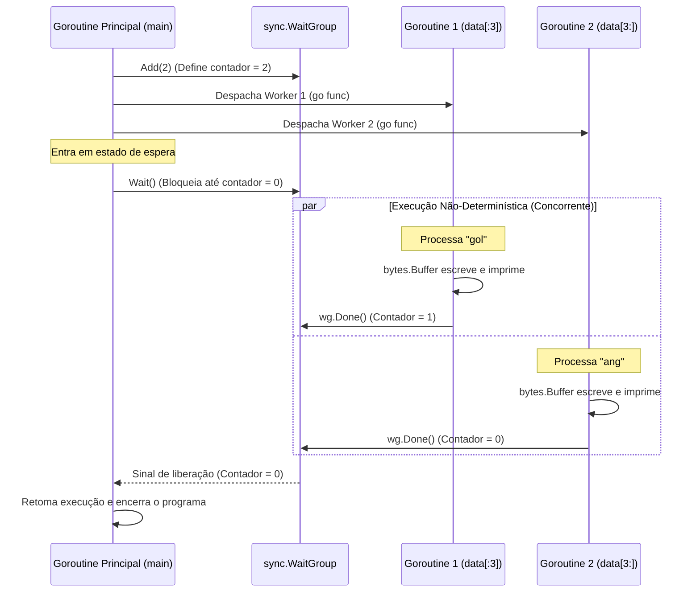

```go
package main

import (
    "bytes"
    "fmt"
    "sync"
)

func main() {
    printData := func(wg *sync.WaitGroup, data []byte) {
        defer wg.Done()

        var buff bytes.Buffer
        for _, b := range data {
            fmt.Fprintf(&buff, "%c", b)
        }
        fmt.Println(buff.String())
    }

    var wg sync.WaitGroup
    wg.Add(2)
    data := []byte("golang")
    go printData(&wg, data[:3]) // <1>
    go printData(&wg, data[3:]) // <2>

    wg.Wait()
}

```

### 1. Visão Geral

O trecho de código demonstra o padrão de **Sincronização de Tarefas (Task Synchronization)** no Go utilizando a estrutura `sync.WaitGroup`. O problema específico que ele resolve no ecossistema da linguagem é a orquestração segura do encerramento do programa: ele impede que a *Goroutine Principal* (a função `main`) finalize sua execução antes que as rotinas secundárias despachadas assincronamente terminem seu processamento.

### 2. Organização por Tópicos

Para dominar a mecânica deste padrão, o código deve ser analisado através de três pilares técnicos:

* **Orquestração de Estados (WaitGroup):** A mecânica de incremento, decremento e bloqueio (barrier) para sincronização.
* **Passagem por Referência (Pointers) em Primitivas de Sincronização:** A necessidade absoluta de compartilhar o mesmo endereço de memória do `WaitGroup` para evitar Deadlocks por cópia de Lock.
* **Fatiamento Seguro de Memória (Slicing):** O compartilhamento de segmentos de um mesmo Array subjacente sem cópia de dados.
* **Construção Otimizada de Strings (`bytes.Buffer`):** Redução de alocações na heap ao manipular coleções de caracteres.

### 3. Visualização do Fluxo (Mermaid)



#### Implementação Passo a Passo (Diagrama)

* **Por que o contador é definido antes do despacho?** A chamada `wg.Add(2)` deve ocorrer obrigatoriamente *antes* das goroutines serem lançadas. Se as goroutines fossem lançadas antes do `Add()`, a rotina principal poderia atingir o `Wait()` e encerrar o programa antes que o escalonador do Go (Scheduler) tivesse a chance de executar as goroutines e incrementar o contador.
* **Como funciona a liberação?** O método `Wait()` atua como uma barreira (semafórica). Ele pausa a thread de execução atual até que as chamadas independentes de `Done()` zerem o contador interno.

---

### 4. Exemplos de Código (Idiomático) e 5. Implementação Passo a Passo

#### Tópico: Inicialização e Passagem por Referência do WaitGroup

```go
var wg sync.WaitGroup
wg.Add(2) // Registra 2 tarefas a serem aguardadas

// Injeção do endereço de memória do WaitGroup (&wg)
go printData(&wg, data[:3]) 

```

```go
// A função recebe um PONTEIRO para o WaitGroup
printData := func(wg *sync.WaitGroup, data []byte) {
    defer wg.Done() // Decrementa o contador ao final do escopo
    // ...
}

```

**Implementação Passo a Passo:**

* **O quê:** A injeção da dependência `sync.WaitGroup` através do ponteiro `*sync.WaitGroup`.
* **Por quê:** O pacote `sync` do Go não permite a cópia por valor de suas primitivas (elas contém `sync.Mutex` internamente). Se você passar o `WaitGroup` sem o operador `&` (ponteiro), o Go criará uma cópia completa da estrutura. Quando a goroutine chamar `Done()` na cópia, o `WaitGroup` original na rotina principal nunca será decrementado, resultando em um bloqueio eterno (`fatal error: all goroutines are asleep - deadlock!`).
* **Como:** Passando `&wg`, ambas as goroutines acessam exatamente a mesma estrutura em memória gerenciada pela `main`, permitindo que o estado atômico interno seja atualizado corretamente e o `Wait()` receba o sinal correto. O uso do `defer wg.Done()` assegura que a sinalização de término ocorra até mesmo se ocorrer um pânico na função.

#### Tópico: Compartilhamento Eficiente de Memória (Slicing)

```go
data := []byte("golang")

// Metade 1: Índices 0, 1 e 2 ("gol")
go printData(&wg, data[:3]) 

// Metade 2: Índices 3, 4 e 5 ("ang")
go printData(&wg, data[3:]) 

```

**Implementação Passo a Passo:**

* **O quê:** O operador de particionamento (slicing) `[start:end]` do Go para dividir o *slice* original de bytes em dois novos *slices*.
* **Por quê:** O Go otimiza o particionamento. Ele não copia os dados para um novo local de memória. Em vez disso, ele cria uma nova estrutura de *slice* (que possui apenas um ponteiro, um comprimento e uma capacidade) que aponta para diferentes seções do mesmo *array* subjacente em memória. Isso é O(1) em tempo e alocação.
* **Como:** `data[:3]` (omissão do início) pega desde o índice 0 até o limite exclusivo 3. `data[3:]` (omissão do fim) pega do índice 3 até o final da capacidade. As duas goroutines podem ler diferentes partes da mesma matriz original concorrentemente de forma segura (Data-Race free), pois estão apenas executando operações de leitura, sem mutação dos dados.

#### Tópico: Construção de Strings Otimizada

```go
var buff bytes.Buffer

for _, b := range data {
    // Escreve o byte diretamente no buffer formatado como caractere
    fmt.Fprintf(&buff, "%c", b)
}

// Converte e emite a string compilada apenas no final
fmt.Println(buff.String())

```

**Implementação Passo a Passo:**

* **O quê:** A utilização da estrutura `bytes.Buffer` do pacote `bytes` para concatenar/construir a saída de texto.
* **Por quê:** Em Go, as strings são imutáveis. Fazer concatenação utilizando o operador `+=` dentro de um laço cria uma nova string e gera uma nova alocação de memória a cada iteração, sobrecarregando o Garbage Collector (GC). O `bytes.Buffer` gerencia internamente um *slice* mutável, amortizando as alocações.
* **Como:** O laço itera sobre o *slice* particionado. `fmt.Fprintf` injeta os caracteres na referência da memória do buffer (`&buff`). No fim do laço de leitura, `buff.String()` aloca a string final resultante uma única vez e a repassa para o `fmt.Println` exibi-la na saída padrão. O resultado final será `gol` e `ang` impressos na tela em ordem não-determinística, dependendo de qual goroutine o escalonador do Sistema Operacional executou primeiro.