```go
package main

import (
    "fmt"
    "net/http"
)

func main() {
    checkStatus := func(
        done <-chan interface{},
        urls ...string,
    ) <-chan *http.Response {
        responses := make(chan *http.Response)
        go func() {
            defer close(responses)
            for _, url := range urls {
                resp, err := http.Get(url)
                if err != nil {
                    fmt.Println(err) // <1>
                    continue
                }
                select {
                case <-done:
                    return
                case responses <- resp:
                }
            }
        }()
        return responses
    }

    done := make(chan interface{})
    defer close(done)

    urls := []string{"https://www.google.com", "https://badhost"}
    for response := range checkStatus(done, urls...) {
        fmt.Printf("Response: %v\n", response.Status)
    }
}

```

### 1. Visão Geral

O trecho de código implementa o padrão de **Cancelamento Preemptivo (Done Channel / Cancellation Pattern)** em uma arquitetura de *Pipeline* ou *Generator*. O problema específico que este padrão resolve no ecossistema do Go é a prevenção de **Goroutine Leaks** (vazamento de recursos). Ele garante que uma goroutine produtora em background possa ser interrompida com segurança caso a rotina consumidora termine precocemente, sofra um erro ou o programa precise ser encerrado, evitando que o produtor fique bloqueado eternamente tentando enviar dados para um canal que ninguém mais está lendo.

### 2. Organização por Tópicos

O funcionamento seguro desta arquitetura fundamenta-se nos seguintes componentes técnicos:

* **O Canal de Sinalização (Done Channel):** Utilização de um canal sem envio de dados reais apenas para propagar o estado de cancelamento (Broadcast de encerramento).
* **Multiplexação de Canais (`select`):** A estrutura que permite à goroutine aguardar múltiplos eventos de comunicação simultaneamente.
* **Funções Variádicas (Variadic Functions):** Empacotamento e desempacotamento flexível de coleções de parâmetros (`...type`).
* **Tratamento e Supressão de Erros no Produtor:** Lógica de bypass (ignorar e continuar) em falhas pontuais de iteração.

### 3. Visualização do Fluxo (Mermaid)

```mermaid
sequenceDiagram
    participant Main as Goroutine Principal
    participant Done as Canal (done)
    participant Worker as Goroutine Secundária (checkStatus)
    participant Web as Servidor Externo (HTTP)
    participant Chan as Canal (responses)

    Main->>Done: Cria canal de cancelamento
    Main->>Worker: Invoca checkStatus com (done, urls...)
    Worker->>Chan: Cria canal (responses)
    Worker-->>Main: Retorna <-chan *http.Response
    
    rect rgb(30, 30, 30)
        Note over Worker,Chan: Loop de Processamento (URLs)
        Worker->>Web: http.Get("https://www.google.com")
        Web-->>Worker: Retorna http.Response
        
        Note over Worker,Chan: Bloco Select (Multiplexação)
        Worker->>Worker: Avalia: <-done ou responses <- resp ?
        Worker->>Chan: Envia resposta (responses <- resp)
        Chan-->>Main: Consome e imprime Status
        
        Worker->>Web: http.Get("https://badhost")
        Web-->>Worker: Retorna Erro (DNS/Host)
        Worker->>Worker: Imprime erro (fmt.Println) e faz 'continue'
    end
    
    Main->>Main: Fim do loop 'for range' na main
    Main->>Done: defer close(done) (Executado ao sair da main)
    Done-->>Worker: Broadcast de cancelamento (se Worker ainda rodasse)
    Worker->>Chan: defer close(responses)
    Note over Worker: Fim da Goroutine Produtora

```



#### Implementação Passo a Passo (Diagrama)

* **Por que o `select` é o coração deste fluxo?** No diagrama, a goroutine produtora precisa enviar dados para o consumidor. Se o consumidor parar de ler, o envio `responses <- resp` bloquearia para sempre. O bloco `select` cria uma bifurcação: a goroutine tenta enviar o dado, mas escuta simultaneamente o canal `done`. Se o `done` for fechado, o `select` escolhe a rota de saída (`return`), matando a goroutine instantaneamente.
* **Como o encerramento em cascata funciona?** Quando a `main` termina, o `defer close(done)` é acionado. O fechamento de um canal no Go atua como um sinal de broadcast. Qualquer goroutine presa em `<-done` é imediatamente destravada com o *zero-value* do canal, engatilhando o retorno da função.

---

### 4. Exemplos de Código (Idiomático) e 5. Implementação Passo a Passo

#### Tópico: O Padrão Done Channel (Sinalização de Cancelamento)

```go
// Criação do sinal. Idiomaticamente em Go, prefere-se chan struct{} 
// pois não aloca memória (tamanho zero), mas interface{} cumpre o papel.
done := make(chan interface{})

// O fechamento garante que o sinal seja emitido ao fim do escopo
defer close(done)

// ... injeção do sinal no produtor ...
urls := []string{"https://www.google.com", "https://badhost"}
for response := range checkStatus(done, urls...) {
    // Consumo dos dados
}

```

**Implementação Passo a Passo:**

* **O quê:** Criação de um canal de controle gerenciado pelo consumidor (neste caso, a função `main`).
* **Por quê:** A regra de ouro da concorrência em Go é: *quem cria a goroutine deve saber quando e como ela vai terminar*. O consumidor detém a posse do canal `done` e o injeta como dependência de somente-leitura (`<-chan`) no produtor.
* **Como:** Quando `close(done)` é executado, o Go avisa todas as rotinas que estão escutando este canal. Isso sinaliza o aborto da operação em background, garantindo a liberação de recursos do Sistema Operacional.

#### Tópico: Multiplexação com Select (Prevenção de Deadlocks)

```go
select {
case <-done:
    // Rota 1: O consumidor cancelou a operação ou a main terminou.
    return 
case responses <- resp:
    // Rota 2: O consumidor está pronto, entrega o payload.
}

```

**Implementação Passo a Passo:**

* **O quê:** A instrução `select` monitorando múltiplas operações de canal.
* **Por quê:** Se usássemos apenas `responses <- resp` sem o `select`, a goroutine produtora ficaria em estado vegetativo (blocked) indefinidamente caso o loop principal na `main` sofresse um `break` prematuro e parasse de extrair dados do canal `responses`.
* **Como:** O `select` bloqueia até que um de seus `cases` possa ser executado. Se o consumidor estiver no laço `range`, o `case responses <- resp` avança. Se o consumidor fechar o canal `done` via `close()`, o `case <-done` é ativado, executando o `return` e encerrando a goroutine geradora sem vazar memória.

#### Tópico: Tratamento de Erros e Padrão Fire-and-Forget

```go
resp, err := http.Get(url)
if err != nil {
    fmt.Println(err) // Imprime silenciosamente no background (side-effect)
    continue         // Pula para a próxima iteração
}

```

**Implementação Passo a Passo:**

* **O quê:** O bypass do erro na requisição da URL incorreta (`https://badhost`).
* **Por quê:** O padrão arquitetural implementado neste *generator* ignora falhas pontuais. Ele prioriza a entrega do que deu certo em vez de interromper o fluxo inteiro por causa de um erro.
* **Como:** Ao encontrar o erro de DNS em `badhost`, a goroutine simplesmente emite a string de erro no *stdout* do console e invoca `continue`. O dado não é enviado para o canal `responses`, e o consumidor (a `main`) nem toma conhecimento de que um erro ocorreu na pipeline de produção; ele simplesmente recebe menos pacotes do que o tamanho do slice original.

#### Tópico: Empacotamento de Parâmetros Variádicos

```go
checkStatus := func(done <-chan interface{}, urls ...string) <-chan *http.Response {
    // Dentro da função, 'urls' é tratado como um slice de strings: []string
}

// ... chamada da função ...
urlsSlice := []string{"https://www.google.com", "https://badhost"}
responses := checkStatus(done, urlsSlice...)

```

**Implementação Passo a Passo:**

* **O quê:** Uso dos três pontos `...` tanto na assinatura da função quanto no argumento da chamada.
* **Por quê:** Proporciona uma API fluente. Permite que o chamador passe múltiplas strings separadas por vírgula `checkStatus(done, "url1", "url2")` ou, como utilizado no código, desempacote um slice inteiro diretamente nos argumentos da função.
* **Como:** O sufixo `...type` na assinatura da função agrupa os argumentos recebidos num *slice* dinâmico. Na invocação, o operador `slice...` (Spread Operator do Go) explode o array de `[]string` em argumentos individuais, aderindo ao contrato variádico da função.