```go
package main

import (
    "fmt"
    "net/http"
)

func main() {
    type Result struct { // <1>
        Error    error
        Response *http.Response
    }
    checkStatus := func(done <-chan interface{}, urls ...string) <-chan Result { // <2>
        results := make(chan Result)
        go func() {
            defer close(results)

            for _, url := range urls {
                var result Result
                resp, err := http.Get(url)
                result = Result{Error: err, Response: resp} // <3>
                select {
                case <-done:
                    return
                case results <- result: // <4>
                }
            }
        }()
        return results
    }

    done := make(chan interface{})
    defer close(done)

    urls := []string{"https://www.google.com", "https://badhost"}
    for result := range checkStatus(done, urls...) {
        if result.Error != nil { // <5>
            fmt.Printf("error: %v\n", result.Error)
            continue
        }
        fmt.Printf("Response: %v\n", result.Response.Status)
    }
}

```

### 1. Visão Geral

Este trecho de código implementa o padrão de **Propagação de Erros em Concorrência (Concurrent Error Handling)** acoplado ao padrão de Cancelamento Preemptivo. O problema específico que ele resolve no ecossistema do Go é a incapacidade de goroutines secundárias retornarem erros diretamente para a função chamadora. Em Go, como as goroutines operam em pilhas de execução independentes, qualquer erro gerado em background precisa ser empacotado junto com o resultado esperado e transmitido explicitamente através de canais para que a rotina principal (consumidora) possa tratá-lo.

### 2. Organização por Tópicos

A arquitetura robusta deste script baseia-se nos seguintes pilares:

* **Estrutura de Transferência (Data Transfer Object - DTO):** Agrupamento do resultado bem-sucedido e da interface de erro em um tipo unificado.
* **Canal Tipado Complexo:** Substituição do envio de dados puros pelo envio da estrutura encapsulada.
* **Delegação de Responsabilidade:** O produtor não toma decisões sobre falhas; ele apenas as reporta. O tratamento (log, retry, abort) fica a cargo exclusivo do consumidor.

### 3. Visualização do Fluxo (Mermaid)

```mermaid
sequenceDiagram
    participant Main as Consumidor (main)
    participant Done as Canal (done)
    participant Worker as Produtor (checkStatus)
    participant Web as Servidor HTTP
    participant Chan as Canal de Resultados (results)

    Main->>Worker: Inicia checkStatus(urls...)
    Worker->>Chan: make(chan Result)
    Worker-->>Main: Retorna <-chan Result
    
    rect rgb(30, 30, 30)
        Note over Worker,Web: Iteração 1: Sucesso
        Worker->>Web: GET https://www.google.com
        Web-->>Worker: HTTP 200 OK
        Worker->>Worker: Cria Result{Error: nil, Response: resp}
        Worker->>Chan: Envia Result via select
        Chan-->>Main: Extrai Result
        Main->>Main: Verifica Error == nil (Falso)
        Main->>Main: Imprime Status HTTP
    end
    
    rect rgb(50, 30, 30)
        Note over Worker,Web: Iteração 2: Falha
        Worker->>Web: GET https://badhost
        Web-->>Worker: Erro (DNS/Dial)
        Worker->>Worker: Cria Result{Error: err, Response: nil}
        Worker->>Chan: Envia Result via select
        Chan-->>Main: Extrai Result
        Main->>Main: Verifica Error != nil (Verdadeiro)
        Main->>Main: Imprime Erro e aciona 'continue'
    end
    
    Worker->>Chan: defer close(results)
    Chan-->>Main: Fim do range

```



#### Implementação Passo a Passo (Diagrama)

* **Por que criar um tipo específico?** O diagrama mostra que tanto em caso de sucesso quanto de falha, o canal `results` recebe a mesma entidade estrutural. Isso garante consistência no contrato de comunicação. O canal não precisa saber se o conteúdo é bom ou ruim, ele apenas transporta o pacote.
* **Onde o erro é avaliado?** Diferente de padrões onde o Worker aborta silenciosamente, aqui o fluxo delega a decisão para a `Main`. O Worker simplesmente repassa o estado da requisição externa e se prepara imediatamente para a próxima URL.

---

### 4. Exemplos de Código (Idiomático) e 5. Implementação Passo a Passo

#### Tópico: Estrutura de Transferência de Dados (DTO)

```go
type Result struct {
    Error    error
    Response *http.Response
}

```

**Implementação Passo a Passo:**

* **O quê:** Definição de uma estrutura anônima (declarada dentro da `main`, limitando seu escopo de uso).
* **Por quê:** O pacote `net/http` retorna duas variáveis na chamada `http.Get`: `(*http.Response, error)`. Como um canal no Go só pode transportar **um** tipo de dado por vez, precisamos agrupar esses dois retornos em um único pacote de dados.
* **Como:** A estrutura atua como um invólucro. Se a requisição for bem-sucedida, `Error` será `nil` e `Response` conterá o ponteiro. Se falhar, `Error` conterá a interface de erro e `Response` será `nil`.

#### Tópico: Empacotamento e Emissão Concorrente

```go
checkStatus := func(done <-chan interface{}, urls ...string) <-chan Result {
    results := make(chan Result)
    // ...
    for _, url := range urls {
        var result Result
        resp, err := http.Get(url)
        
        // Empacota independentemente do sucesso ou falha
        result = Result{Error: err, Response: resp} 
        
        select {
        case <-done:
            return
        case results <- result: // Envia a struct completa para o canal
        }
    }
    // ...

```

**Implementação Passo a Passo:**

* **O quê:** Atribuição do par retorno/erro à struct `Result` e envio através do bloco `select`.
* **Por quê:** Tratar o erro dentro da goroutine produtora (ex: fazendo log e ignorando) esconderia falhas críticas da aplicação principal. O objetivo de um *Generator* genérico é produzir os dados de forma agnóstica às regras de negócio.
* **Como:** A atribuição `result = Result{Error: err, Response: resp}` é feita incondicionalmente. O Go permite que structs contendo ponteiros nulos (`nil`) sejam transitadas perfeitamente pelos canais. O bloco `select` garante que o envio não cause deadlocks caso a rotina principal decida cancelar a operação (fechando o canal `done`).

#### Tópico: Tratamento de Erros e Separação de Responsabilidades no Consumidor

```go
for result := range checkStatus(done, urls...) {
    // Avaliação explícita da integridade do payload
    if result.Error != nil { 
        fmt.Printf("error: %v\n", result.Error) // \n adicionado para formatação correta
        continue
    }
    
    // Caminho feliz: Executado apenas se não houver erro
    fmt.Printf("Response: %v\n", result.Response.Status)
}

```

**Implementação Passo a Passo:**

* **O quê:** O laço de consumo verificando o campo `.Error` do pacote recebido antes de acessar o campo `.Response`.
* **Por quê:** É aqui que a inversão de controle brilha. A rotina principal tem o poder de decidir se um erro em uma URL específica deve interromper todo o programa (`log.Fatal`), se deve ser apenas registrado (como feito com `fmt.Printf`), ou se deve engatilhar uma nova tentativa (Retry).
* **Como:** Ao extrair a struct `result` do canal, o código checa `result.Error != nil`. Se for verdadeiro, ele entra no bloco `if`, lida com o erro, e a palavra-chave `continue` força o laço a avançar para a próxima iteração, ignorando com segurança o `result.Response` (que neste ponto seria um ponteiro nulo e causaria um *panic* (segmentation violation) se tentássemos acessar `.Status`).