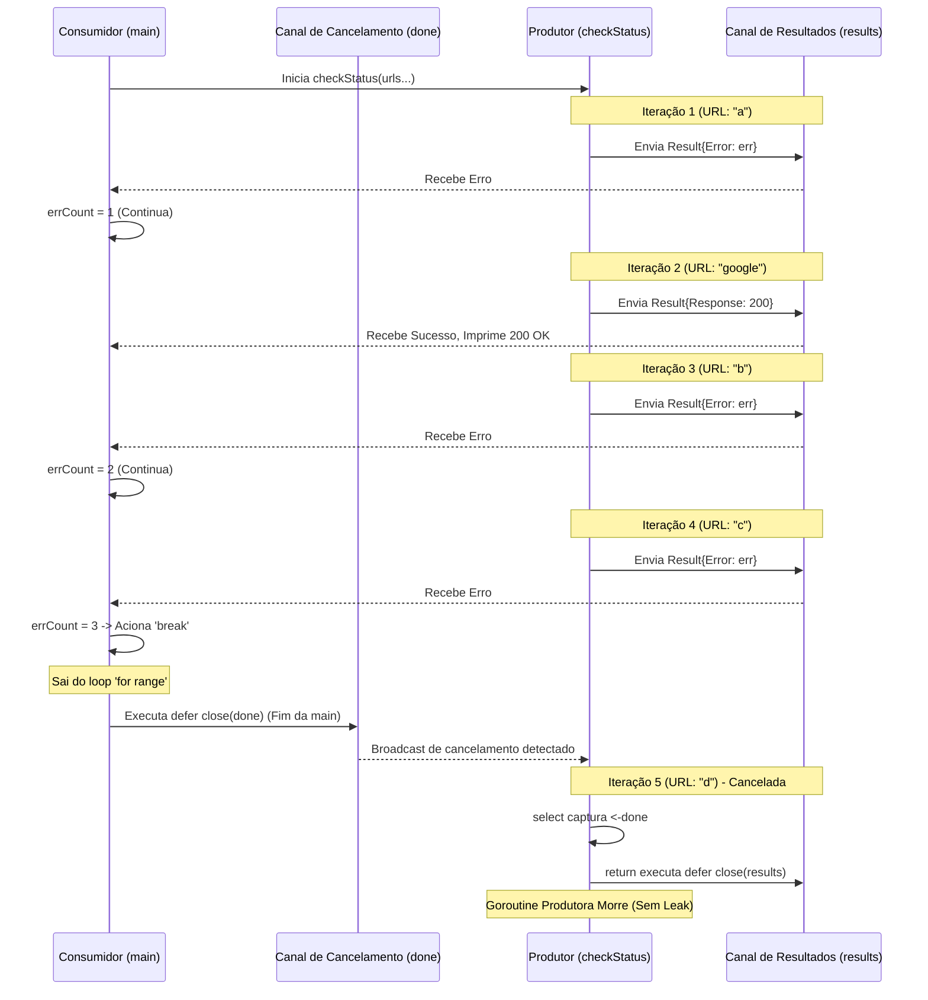

```go
package main

import (
    "fmt"
    "net/http"
)

func main() {
    type Result struct { // <1>
        Error    error
        Response *http.Response
    }
    checkStatus := func(done <-chan interface{}, urls ...string) <-chan Result { // <2>
        results := make(chan Result)
        go func() {
            defer close(results)

            for _, url := range urls {
                var result Result
                resp, err := http.Get(url)
                result = Result{Error: err, Response: resp} // <3>
                select {
                case <-done:
                    return
                case results <- result: // <4>
                }
            }
        }()
        return results
    }
    done := make(chan interface{})
    defer close(done)

    errCount := 0
    urls := []string{"a", "https://www.google.com", "b", "c", "d"}
    for result := range checkStatus(done, urls...) {
        if result.Error != nil {
            fmt.Printf("error: %v\n", result.Error)
            errCount++
            if errCount >= 3 {
                fmt.Println("Too many errors, breaking!")
                break
            }
            continue
        }
        fmt.Printf("Response: %v\n", result.Response.Status)
    }
}

```

### 1. Visão Geral

Este trecho de código demonstra o ápice do padrão de **Cancelamento Preemptivo (Done Channel)** integrado a um mecanismo de **Tolerância a Falhas Limítrofe (Threshold-based Circuit Breaking)**. O problema crítico que ele resolve no ecossistema do Go é evitar o desperdício de recursos computacionais (CPU e Rede) e prevenir vazamentos de memória (Goroutine Leaks) quando uma rotina produtora está operando sobre um lote de dados corrompido ou inatingível. Ele permite que o consumidor defina um limite tolerável de falhas e aborte imediatamente o trabalho em *background* sem esperar a conclusão de todo o lote.

### 2. Organização por Tópicos

A arquitetura preventiva deste código é sustentada por três mecânicas interdependentes:

* **Objeto de Transferência (DTO) para Propagação:** Empacotamento simultâneo do estado de sucesso e falha para trânsito seguro em canais.
* **Heurística de Interrupção (Consumer Break):** Lógica isolada no consumidor para contagem e decisão de interrupção (Circuit Breaker no nível da aplicação).
* **Propagação de Cancelamento em Cascata (Graceful Shutdown):** O mecanismo de descarte seguro da rotina produtora através do gatilho assíncrono gerado pela quebra do laço principal.

### 3. Visualização do Fluxo (Mermaid)



#### Implementação Passo a Passo (Diagrama)

* **Por que o gatilho de cancelamento é essencial aqui?** Quando a `main` atinge 3 erros e executa o `break`, ela para de escutar o canal `results`. O Worker já está avançando para a URL "d". Se não houvesse o canal `done`, o Worker ficaria eternamente bloqueado na linha `case results <- result`, pois ninguém jamais leria o resultado da URL "d".
* **Como o aborto ocorre fisicamente?** O `break` encerra a lógica da função `main`. Ao sair do escopo da `main`, a diretiva `defer close(done)` é engatilhada pelo Go Runtime. Esse fechamento destrava imediatamente o bloco `select` pendente lá dentro do Worker, roteando a execução para o `return` e permitindo que o Garbage Collector limpe a goroutine e as conexões TCP.

---

### 4. Exemplos de Código (Idiomático) e 5. Implementação Passo a Passo

#### Tópico: Estruturação DTO para Auditoria de Erros

```go
type Result struct {
    Error    error
    Response *http.Response
}

// Dentro do loop do Produtor:
var result Result
resp, err := http.Get(url)
result = Result{Error: err, Response: resp} 

```

**Implementação Passo a Passo:**

* **O quê:** Declaração do pacote de transferência e sua respectiva hidratação estrutural incondicional.
* **Por quê:** O consumidor precisa tanto dos dados válidos para processamento quanto da interface de erro para contagem de falhas. Como o Go bloqueia o envio de múltiplos valores simultâneos num canal (`resp, err`), a `struct Result` atua como a entidade unitária permitida.
* **Como:** A atribuição consolida os ponteiros (ou a nulidade deles) retornados pelo pacote HTTP do Go e repassa o veredito bruto para a matriz de comunicação, abstendo-se de qualquer análise contextual dentro da Goroutine geradora.

#### Tópico: Avaliação de Limites e Controle de Fluxo (Consumer Break)

```go
errCount := 0
for result := range checkStatus(done, urls...) {
    if result.Error != nil {
        fmt.Printf("error: %v\n", result.Error)
        errCount++
        
        if errCount >= 3 {
            fmt.Println("Too many errors, breaking!")
            break // Aborta a leitura do canal
        }
        continue // Se < 3, tenta ler o próximo item
    }
    // ...
}

```

**Implementação Passo a Passo:**

* **O quê:** Um contador de estado (stateful) dentro do escopo de consumo monitorando as falhas consecutivas/cumulativas e interrompendo o fluxo.
* **Por quê:** Demonstra a premissa de *inversão de controle* em arquiteturas concorrentes do Go. O Produtor é "burro" e exaustivo. O Consumidor detém a inteligência de negócios: ele tolera falhas isoladas (via `continue`), mas define um ponto de ruptura sistêmico (threshold = 3) para evitar processamento inútil de uma lista que parece majoritariamente corrompida.
* **Como:** A variável `errCount` acompanha as anomalias. Quando a condição `errCount >= 3` é satisfeita, o comando `break` força a saída abrupta do laço iterativo `range checkStatus(...)`.

#### Tópico: Prevenção de Leaks via Cancelamento em Cascata

```go
// Na Goroutine Produtora:
select {
case <-done:
    // Captura o fechamento causado pelo encerramento prematuro da main
    return 
case results <- result:
}

// Na Main (Consumidora):
done := make(chan interface{})
defer close(done) // <-- Garante a limpeza atrelada ao ciclo de vida da função chamadora

```

**Implementação Passo a Passo:**

* **O quê:** O mecanismo assíncrono de interrupção bidirecional orquestrado pela primitiva `select`.
* **Por quê:** Ao executar o `break` (mostrado no tópico anterior), a função principal descarta completamente a referência de leitura do canal `results`. O escalonador (scheduler) detectaria um bloqueio insolúvel se a rotina produtora continuasse tentando despachar as URLs "d" (e subsequentes).
* **Como:** O bloqueio fatal é prevenido pela sincronização reversa. Ao atingir o final de seu escopo lógico por conta do `break`, a `main` executa a pilha de chamadas proteladas (`defer`). O `close(done)` ocorre instantaneamente. O bloco `select` em *background* acorda porque o `done` agora emite um sinal constante e não-bloqueante, optando pelo caminho `case <-done`, executando o `return`, o que dispara seu próprio `defer close(results)` e limpa a goroutine limpamente.